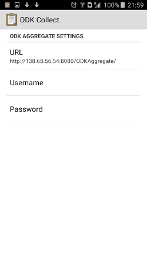
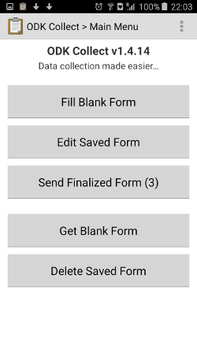
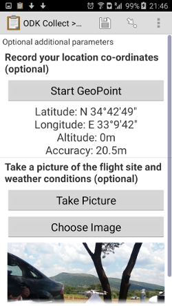
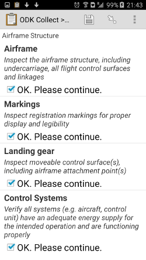
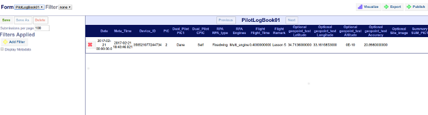
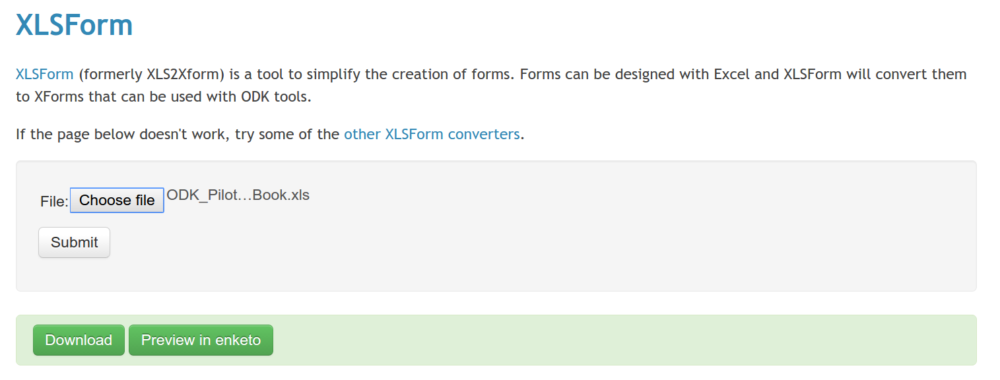

# sUAS-ODK-forms
ODK sample forms for capturing sUAS flight metadata
#HowTo on using ODK for sUAS metadata capture
##Introduction
This is a HowTo/demo for trying out using Open Data Kit [ODK](https://opendatakit.org/) as a means of  capturing  small Unmanned Aircraft Systems [sUAS] relevant.  Full details on setting up your own server and customising your own forms can be found in the great ODK documetation, this readme will only show you only how to use the forms supplied in this repo and using the server infrastructure I've setup.  To use ODK for **your** sUAS operations you will need to set up your own systems but hopefully this demo is enough for you to decide if that's a good idea or not.  

In brief, ODK allows you to make and fill out custom forms on an android/iOS phone, and have the data synced/backed up on a self hosted server for later analytics.  The steps to acomplishing this in brief are:
1. Setup a serve hosting [Aggregate](https://opendatakit.org/use/aggregate/) Aggregate
2. Create (or copy one from here) a relevant form.
3. Collect data.

##Try it out 
###Step1: Setup your phone
1. Install ODK on your phone (just search the play)
2. Configure ODK on your phone to connect to **my** server hosting these example forms:
-- In the app go t "General Settings" > "Configure platform settings" > URL
-- Paste: http://138.68.56.54:8080/ODKAggregate/
 

###Step2: Try entering data
1. In ODK app > Main Menu > "Get Blank Form" > download which ever you want
2. Main Menu > "Fill Blank Form" > select which ever you wish and fill it in by swiping left
3. Name and save form
4. Main Menu > "Send Finalised Form"  to submit it to the Aggregate server
5.   

###Step3: Visualise and use data in Aggregate
 

##Helpful next steps
If you liked what you saw the next steps to having your own system are:
1. Setup [Aggregate](https://opendatakit.org/use/aggregate/) Aggregate on a internet accessible server
2. Customise a form to your own needs, see:
- The ODK example form [here](https://opendatakit.org/wp-content/uploads/2013/06/sample_xlsform.xls) 
- The xml form sytax documentation [here](http://xlsform.org/)
3. Create a form out of a xls document by uploading it [here](http://opendatakit.org/xiframe/) and downloading the resulting xml form.
 
4. Upload your custom xml form to your aggregate server and start capturing data.

